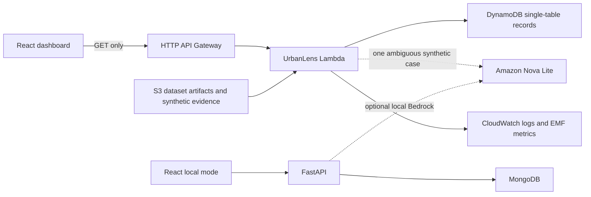

# UrbanLens-AI

## Final AWS Cloud Architecture



The AWS path is an additional deployment mode. Local MongoDB/FastAPI and its existing seed, process, and reset workflow remain available and do not depend on AWS.

The current Tamil Nadu dataset is simulated demonstration data generated within the official study-area boundary. It is not real Google Street View imagery and is not an authoritative property register. Records retain `dataset_id=tn_study_area_demo_v1`, `SIMULATED_TAMIL_NADU_DATA`, `SIMULATED_PROPERTY_REGISTER`, and `simulation=true` where applicable. The official `data/Study_Area/Study_area.geojson` remains the boundary source of truth.

### Historical Deployment Notes — Current Status Not Verified

The resource inventory and verification details below are historical repository notes from an earlier authorized session; they are not a live status check. During the latest read-only audit, `aws sts get-caller-identity` could not reach the configured proxy, so deployed resources, routes, CORS, IAM, S3 policy, DynamoDB contents, and CloudWatch configuration are currently **NOT VERIFIED**. No cloud resource was changed during that audit.

The prior local Nova Lite success and Lambda `AccessDeniedException` are historical reports recorded below, not newly repeated calls. The earlier diagnostic remains **CASE D — INCONCLUSIVE**: the available identity could not inspect/simulate the Lambda role sufficiently to prove the permission path. Do not infer that IAM is definitely the cause.

### Previously Recorded Resource Inventory

- S3: existing `fai-tce-team11-streetview`, `ap-south-1`, prefix `urbanlens/datasets/tn_study_area_demo_v1/`. It contains 20 objects: structured collection artifacts, manifest, official boundary, and six generated synthetic PNGs under `evidence/`. Default SSE-S3 encryption was verified; this identity could not inspect the bucket public-access-block setting, and no bucket policy was changed.
- Lambda: `fai-tce-team11-urbanlens-demo-processor`, Python 3.12, 256 MB, 30-second timeout, execution role `FAI-TCE-LambdaExecutionRole`. It validates S3 provenance, optionally reviews at most one ambiguous synthetic image, upserts observation/run records, and emits structured logs and EMF metrics.
- DynamoDB: on-demand single table `fai-tce-team11-urbanlens-records`; partitioned by dataset, with a dataset/collection GSI. The controlled sync upserts source records and only prunes obsolete keys inside the selected dataset and collection. The verified demo partition contains 407 records across 14 source collections.
- API Gateway: HTTP API `fai-tce-team11-urbanlens-http-api` (`iv8dv4cz59`) at `https://iv8dv4cz59.execute-api.ap-south-1.amazonaws.com`. It exposes GET-only dataset, record, analytics, status, and challenge-query routes for the simulated dataset. The unauthenticated read API is throttled to 5 requests/second with burst 10; there is no public write/processing route.
- CloudWatch: `/aws/lambda/fai-tce-team11-urbanlens-demo-processor`, 14-day retention, structured request/processing logs, and EMF custom metrics in `UrbanLens/Task5`.

Nova Lite is configured as `apac.amazon.nova-lite-v1:0` in `ap-south-1`. One local image request returned successfully, but its multi-building array response did not match the original scalar schema. A conservative normalizer now handles that response shape and is unit-tested; no second real call was made. From Lambda, Nova Lite returned `AccessDeniedException`; the existing execution role needs approved `bedrock:InvokeModel` access for the inference profile/model resources. The FarmwiseAI role policy and IAM simulator were not inspectable with this identity. No IAM permission was changed. DynamoDB/S3 processing still succeeds and records the Bedrock attempt as blocked.

### Authentication and Configuration

Use the existing IAM Identity Center profile and temporary credentials; never add access keys to `.env`, source, or frontend variables:

```powershell
aws sso login --profile farmwiseai
$env:AWS_PROFILE = "farmwiseai"
$env:AWS_REGION = "ap-south-1"
```

Backend values are shown in `backend/.env.example`. Set `URBANLENS_DYNAMODB_TABLE=fai-tce-team11-urbanlens-records`, `URBANLENS_API_GATEWAY_ID=iv8dv4cz59`, `URBANLENS_API_GATEWAY_URL=https://iv8dv4cz59.execute-api.ap-south-1.amazonaws.com`, and `URBANLENS_LAMBDA_BEDROCK_ENABLED=true` only when the role is approved. The frontend uses `frontend/.env.example`; configure `VITE_API_MODE=local` and `VITE_API_BASE_URL=/api` for local mode, or `VITE_API_MODE=aws` and the deployed API URL for AWS mode. The HTTP API is unauthenticated and read-only, serves only this simulated dataset, is throttled to 5 requests/second with burst 10, and has CORS limited to local Vite origins. Do not expose real/private records through it.

### Upload, Sync, and Invoke

Seed the local MongoDB demo using the existing FastAPI route, then from `backend/` run:

```powershell
.\.venv\Scripts\python.exe -m scripts.upload_demo_to_s3
.\.venv\Scripts\python.exe -m scripts.sync_demo_to_dynamodb
.\scripts\deploy_cloud_lambda.ps1
```

The upload and sync operations are explicit and idempotent; neither runs on application startup. The S3 exporter writes the official boundary and simulated records/evidence, then updates the manifest. The DynamoDB sync requires a reachable MongoDB with the seeded dataset. The deploy script updates code only after verifying the existing function and approved execution role; it never creates a function or changes IAM. To invoke the existing Lambda on the S3 observations artifact:

```powershell
$event = '{"dataset_id":"tn_study_area_demo_v1","bucket":"fai-tce-team11-streetview","key":"urbanlens/datasets/tn_study_area_demo_v1/observations/observations.json"}'
aws lambda invoke --profile farmwiseai --region ap-south-1 --function-name fai-tce-team11-urbanlens-demo-processor --cli-binary-format raw-in-base64-out --payload $event response.json
Get-Content response.json
```

The Lambda processes all records with the deterministic simulated pipeline metadata, but calls Nova Lite only for at most one difficult building per invocation when enabled and permitted. It does not perform computer vision locally; the optional Nova call receives one generated synthetic PNG. Costs remain `null`/`unavailable` unless verified prices are configured.

The read-only HTTP API includes `/health`, `/study-area`, `/datasets`, `/observations`, `/buildings`, `/assets`, `/discrepancies`, `/reviews`, `/analytics`, `/aws/status`, and challenge queries under `/queries/`. The building-over-2-floors, missing-streetlight, low-confidence-floor-count, unmatched-by-street, and routed-versus-all-VLM routes use existing synchronized records; all-VLM cost stays unavailable without pricing and no all-VLM model run is claimed.

For local mode, start FastAPI and run `npm run dev` from `frontend/`; Vite proxies `/api` to FastAPI. For AWS cloud mode, configure the frontend process environment and run Vite:

```powershell
cd C:\Users\dhars\UrbanLens-AI\frontend
$env:VITE_API_MODE = "aws"
$env:VITE_API_BASE_URL = "https://iv8dv4cz59.execute-api.ap-south-1.amazonaws.com"
npm run dev
```

The banner identifies AWS cloud data while retaining the simulated-data warning. AWS mode is read-only, including the review queue. Set `VITE_API_MODE=local` (or unset it) to return to the existing MongoDB/FastAPI workflow.

### Tests and Cleanup

Normal backend tests do not call AWS. Run them, plus frontend lint/build, as usual. The real cloud integration is explicitly opt-in:

```powershell
$env:URBANLENS_AWS_INTEGRATION = "1"
.\.venv\Scripts\python.exe -m pytest -q tests/integration/test_aws_s3_lambda.py
```

That test uploads one unique high-confidence JSON fixture, invokes Lambda, verifies DynamoDB write/read, then removes only its S3 key and two dataset-scoped DDB items. Never delete the permanent dataset prefix or whole table/bucket. The test fixtures and permanent demo records remain clearly simulated.
